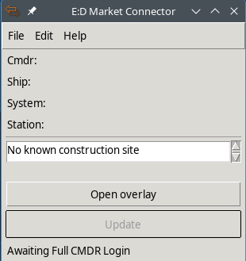

# EDMC_ConstructionHelper

A plugin for the [Elite: Dangerous Market Connector](https://github.com/EDCD/EDMarketConnector) (aka **EDMC**) to help you keep track of the goods required for
colonization construction projects.

## Installation

Download the `.zip` file and unpack it into the `plugins/` directory of **EDMC**, which is shown in the `Plugins` tab of the `Settings` window of **EDMC**.

See also the relevant page on the [EDMC Wiki](https://github.com/EDCD/EDMarketConnector/wiki/Plugins).

## Usage
 
When **EDMC** is started with the ConstructionHelper running, then there will be a space on the main **EDMC** window with a listbox on top and a button 
to open or close the overlay window on the bottom. 

Once you've docked at one or more active construction sites then the listbox will contain names of all known construction sites and the space between the 
listbox and the overlay window button will contain a list of all the goods that you need to finish the selected construction site(s).

There's right-click context menus on the listbox and the goods display that currently allows you to remove site(s) and copy system name(s) or a table 
of the required good to the clipboard.

Via the **EDMC** preferences menu you can configure a couple extra features and et display options. Not all of them are documented here, so have a look at it.

#### Overlay Window

The overlay button will open (or close) an overlay window that contains the same list of needed goods as the main window. It is a simple borderless window that
tries to stay above all other windows, in particular the **ED** game window. If it will be visible for you will depend on your setup. It does work for me on my 
Linux system and it seems to work on a typical windows system if **ED** is not running in fullscreen mode but e.g. in borderless mode. 
By default the overlay window will be in the top left corner of your (primary) screen but that can be changed.\
Note: if you can't see the overlay window, check if there is a list of goods displayed in the main **EDMC** window. If there isn't then the overlay window is a 
small, easy to miss, dark rectangle in the corner of your screen. (And it may be fully transparent, making it impossible to see.)

[<picture>
  
</picture>](https://raw.githubusercontent.com/ahoannon/EDMC_ConstructionHelper/refs/heads/main/doc/Overlay_Linux.png)
[<picture>
  
</picture>](https://raw.githubusercontent.com/ahoannon/EDMC_ConstructionHelper/refs/heads/main/doc/Overlay_Windows.png)

#### Multiple Construction Sites

Once you have docked at a construction site that you haven't visited previously and wasn't know to the plugin then a name for this site (the plugin will try to come 
up with something short and useful) is added to the listbox and the needed goods will be displayed by selecting that new entry in the listbox.

If you have visited more than one construction site then you can select multiple sites in the listbox. If you do so then the list of needed goods will be 
the sum of the goods needed for all selected sites.

If you select no site then the list of needed goods will be empty.\
If you visit a new construction site then the selection will be reset to only this new site as mentioned earlier.

#### Customization

[<picture>
  
</picture>](https://raw.githubusercontent.com/ahoannon/EDMC_ConstructionHelper/refs/heads/main/doc/Preferences.png)

You can set parameters for the overlay window in the preferences. No real range- or other checking is done. So if you enter invalid values then it will probably 
fail in some random way or another. The string for the colors can either be a hex RGB value like the default for the text color, or a color name that TK 
understands.

#### Data Storage and Data Sharing

In the prefenreces you can configure a local file in which the current status of the construction sites is stored and read in at plugin start.

You can also configure a file on an FTP server to store the current status of the construction sites. This way multiple CMDRs can share the
status of construction sites by use the same file on the same server. To work properly every CMDR needs read and write access to that remote file. 
**Note:** This does pose a security risk, both for the server and the user running the plugin. I personally consider the risk small enough that I'm 
using the fearure, but your mileage may vary.

#### Copying to Clipboard

Currently you can copy the star system name(s) of the selected site(s) or the currently displayed list of required goods to the clipboard. When only
site(s) from one system are selected then the copied system name is suitable for pasting into the **ED** galaxy map. When sites from multiple systems
are selected then they will be copied as a comma separated list. The required goods are copied with interspersed TAB and newline characters in a format 
that is suitable for pasting into a spreadsheet.

## Technical Stuff

This plugin is based on the `ColonisationConstructionDepot` logfile event that **FDev** introduced with the "Corsair" update on Tuesday April 8th 2025.
It identifies construction sites by the fact that it sees such an event from there and then tries to come up with a suitable name for the station with the same 
MarketID. 

The locally stored construction site status is only read in at the start of the plugin. It is stored whenever you are docked at a construction site and receive 
a new status. 
The status stored on the FTP server is retrieved at the start of the plugin and whenever you dock at a non-construction-site station. So it won't give you
a (near-)real-time update on the activities of your friends, but it will give you a current status when I believe you are about to load goods for construction.
It will only upload the status to the FTP server when you visit a new, previously unknow site or contribute goods to a site yourself.

The `tkinter` cpliboard function does not work well together with **ED** on Linux. (The first copy is seen by **ED**, all subsequent copy events seem to 
be ignored.) So if you run this plugin on Linux it will check if a `xclip` executable is in the current `PATH`. If it is found then that is used instead of 
the `tkinter` cpliboard function, otherwise pasting into the **ED** galaxy map may not work well.  
(Note: **xclip** is also used by the excellent [SpanshRouter](https://github.com/norohind/EDMC_SpanshRouter) plugin, shoutout to that.)

## Licence 

This software is licensed under the [GNU General Public License v3.0](https://github.com/ahoannon/EDMC_ConstructionHelper/blob/main/LICENSE). 

Greetings, CMDR Hans Wijn

## ToDo 

- find and fix bugs
- display current ship cargo
- sort goods by category
- handle localized goods names
- option to use the [EDMC Overlay](https://github.com/inorton/EDMCOverlay) plugin instead of the TK window(?)
- can I add expiry time for primary ports?
